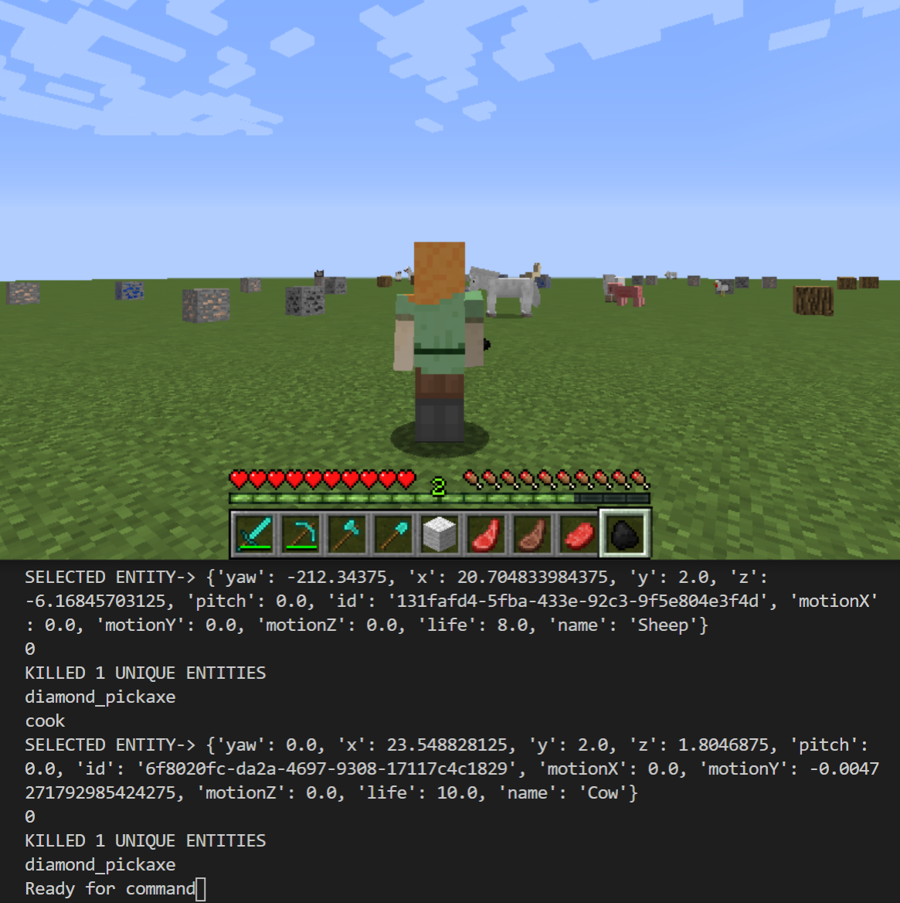
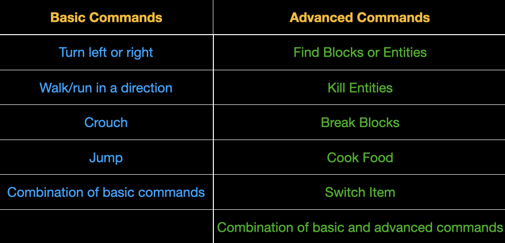

# Speech-To-Steve 

Speech-To-Steve project is aiming to allow users to control the malmo agents via speech. At a high level, this is implemented by taking speech from the user and coverting it into text using Google SpeechRecognition, and using NLP libraries spaCy to parse and process the text to parameters, which will be fed to the commands in malmo. In addition, we implemented similarity check to the objects and multistep commands. This allows our agent, for example, understanding that stallions and horses are the same, or jumping exactly 10 times if such commands are given.

### Voice Commands Supported

### Accuracy Evaluation:
  
