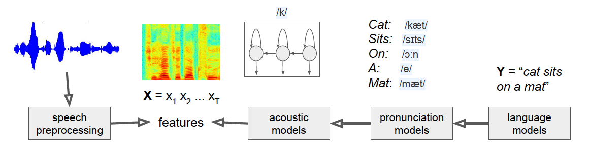
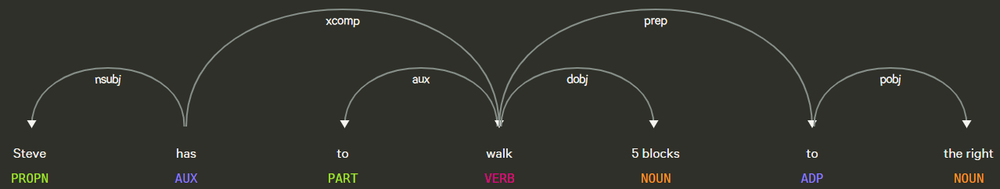

## Video Summary

## Project Summary

The main idea of our project is using Python to implement a way for the user to control the AI agent via speech. At a high level, this is implemented by taking speech from the user and coverting it into text using Google SpeechRecognition, and using NLP libraries spaCy to parse and process the text to parameters, which will be fed to the commands in malmo. In addition, we implemented similarity check to the objects and multistep commands. This allows our agent, for example, understanding that stallions and horses are the same, or jumping exactly 10 times if such commands are given. 

#### Language: Python
#### Library Support: 
- SpeechRecognition
- PyAudio
- NeuralCoref
- spaCy

#### Implemented Commands

| Basic | Advanced| 
| -------------   | ------------- |
|Turn left or right  | Find blocks /entities|
|Walk/run in a direction| Kill entities|
|Crouch| Break blocks |
|Jump| Cook food|
|| Swtich item|
|| Combination of basic and advanced commands|

## Approaches

In order to implement Speech-To-Steve, we relied heavily on natural language processing to parse spoken commands into a format that the Malmo agent could "understand" and execute. To begin with, we needed to capture audio input from the user and convert it into a string that can be further parsed. We decided to use the PyAudio library to record microphone input and the SpeechRecognition library to convert the audio input into a string. The SpeechRecognition library simply provides a way to connect existing speech recognition APIs to Python seamlessly. For Speech-To-Steve, we decided on using the free Google Speech Recognition API due to its high accuracy from utilizing Google's extensive and powerful machine learning technology. SpeechRecogntion allows us to convert the results of parsing our audio input through the Google Speech Recognition API into a string, which we will further parse.

### Classical Speech Recognition System

Essentially, the Google Speech Recognition API will break down an audio file into small pieces and analyzed by a trained learner. The learner will attempt to match each piece to a phoneme (also sometimes called a token), and then feeds a sequence of phonemes into an acoustic model to figure out how the sequence sounds like. This is then matched to the word that the model thinks is the mostly likely to have been spoken by the user. While Google's exact process of converting speech to text is unavailable to the general public, we know that they are utilizing deep learning neural networks to create a more advanced version of the system described above.

The next step in parsing the input from the user is to extract information and context from the string, in order to figure out what the user wants the agent to do in Malmo. This requires us to once again utilize natural langage processing. In this step, however, we are focused on **tokenization**. Tokenization is the process of breaking down the string into separate sections called tokens, which can be then passed on for further parsing. For Speech-To-Steve, tokenization will break down the string returned by the Google Speech Recognition API into individual words. Once we have the individual tokens, we can then further categorize them to provide context for the agent. For example, we can differentiate between parts of speech (e.g. adjectives, nouns, verbs) and the relationship between each token (e.g. recognizing that "red" refers to "apple" in the phrase "the red apple").

### spaCy and NeuralCoref

## Evaluation
We will evaluate the success of our project based on the complexity of the commands we can implement accurately and how well the agent performs tasks. There are different tiers of difficulty for commands: “Find a sheep” is much easier to implement than “Find a sheep and kill it with diamond sword, then cook it”. We are aiming to implement commands that are pretty complex and interact with the environment (e.g. “break a coal block”), with a moonshot case being extremely complex commands that need contextual understanding (e.g. “enter the third house on the right”).

### Qualitative:
We intend to evaluate our success qualitatively by visually checking if the agent can actually perform commands. For example, we will check if the the agent actually moves 5 blocks to the left if it is given the command “walk 5 blocks left". 

### Quantitative:
We intend to evaluate our success quantitatively by measuring the accuracy of our voice commands and command completion rate. In other words, we will calculate the proportion of successfully recognized voice commands to the total number of voice commands given, and proportion of correctly executed commands to the total successfully recognized voice commands. (e.g. the agent actually moves north when given the command to go north, the agent can recognize objects in Minecraft successfully). 

###  Basic Commands
We set 25 basic commands in total with each tested 10 times, and the details can be checked in "docs/basic_commands_eval.txt". According to the evaluation table in 'basic_commands_evaluation.md', we derived that speech recognition rate is, command parsing rate is, and successfully executed commands rate is. Below shows some examples and our evaluation criterion for basic commands. 

| walk to the left for 10 steps|run 10 steps to the right, and then jump 5 times|hurdle 5 times go forward for 10 blocks| 
| -------------   | ------------- | ------------- |
|Speech Recognized | Speech Recognized|Speech Recognized|
|Parse Correctly| Parse Correctly|Parse Correctly|
|Execute Successfully| Execute Successfully|Execute Successfully|

###  Advanced Commands
We set 25 advanced commands in total with each tested 10 times, and the details can be checked in "docs/advanced_commands_eval.txt". According to the evaluation table in 'basic_commands_evaluation.md', we derived that speech recognition rate is, command parsing rate is, and successfully executed commands rate is.  Below shows some examples and our evaluation criterion for advanced commands. 

| Find Iron| Find a pig and a sheep, and kill them |Find a pig and cook porkchop| Murder the farthest stallion with a blade | 
| -------------   | ------------- | ------------- | ------------- |
|Speech Recognized | Speech Recognized|Speech Recognized| Speech Recognized|
|Parse Correctly| Parse Correctly|Parse Correctly|Parse Correctly|
|Execute 1/1 action Successfully| Execute 4/4 actions Successfully|Execute 2/2 Successfully|Execute 1/1 Successfully|

## Resources Used
- [SpeechRecognition](https://pypi.org/project/SpeechRecognition/)\
library for performing speech recognition
- [PyAudio](https://pypi.org/project/PyAudio/)\
record audio input from microphone
- [spaCy](https://spacy.io/usage/spacy-10z)\
information extraction and natural language understanding
- [NeuralCoref](https://github.com/huggingface/neuralcoref/pulls)\
a pipeline extension for spaCy 2.1+ which annotates and resolves coreference clusters using a neural network

## References
- David M. Bignell. craft_work.py https://github.com/microsoft/malmo/blob/master/Malmo/samples/Python_examples/craft_work.py (2018)
- Food -Official Minecraft Wiki https://minecraft.gamepedia.com/Food

